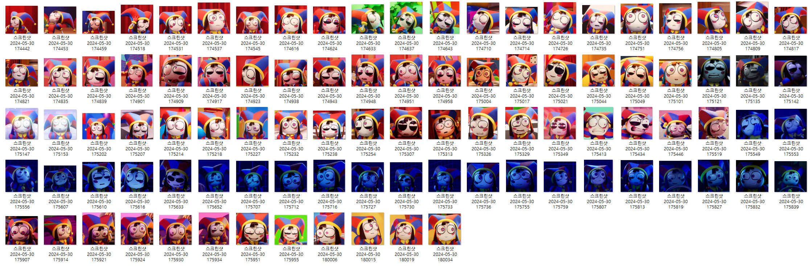

# the-amazing-digital-circus-character-face-classification-with-deep-learning
Description: This repository contains code for creating, testing, and saving a deep learning model for classifying the faces of 8 characters from the animation "The Amazing Digital Circus". Due to copyright constraints, the dataset and the final trained model are not included. The project utilizes transfer learning with a pretrained ResNet model and provides detailed instructions for replicating the model training process with your own dataset.

---

Welcome to my GitHub repository! This project focuses on classifying character faces from the animation "The Amazing Digital Circus" using deep learning techniques.

## Prerequisites
Install `Python`, `PyTorch`, `Numpy`, `Matplotlib`, `CUDA`, and `cuDNN` libraries on your computer.
Ensure you have an NVIDIA graphics card.

## Dataset Preparation
I have created a dataset of faces for eight characters from "The Amazing Digital Circus": `Bubble`, `Caine`, `Gangle`, `Jax`, `Kinger`, `Pomni`, `Ragatha`, and `Zooble`. Each character has 120 face images, captured by taking screenshots while playing the animation. These images are divided into training (96 images) and validation (24 images) sets in an 8:2 ratio.

## Folder Structure
1. Create a folder named `Character_Faces`.

2. Inside `Character_Faces`, create `train` and `val` folders.

3. Within both `train` and `val`, create folders named after each character.

4. Save the images into the corresponding character folders as shown in the following structure:

Make sure each character folder in the `train` folder contains 96 images and each character folder in the `val` folder contains 24 images. To comply with copyright issues, I have blurred the character images.

## Getting Started
1. Install Visual Studio Code and run the provided Jupyter Notebook file named `animation_character_classifier.ipynb`. [Click here to open the animation_character_classifier.ipynb file](./animation_character_classifier.ipynb)
2. The code is divided into steps:
- Step 0: Check if the GPU is available by verifying that `CUDA is available.` is printed.
- Steps 1-6: Execute these steps to train the model. If done correctly, the trained model will be saved as `best_model.pth`.
- Step 7-8: Test the model with eight random images.
- Step 9: Test a specific image named `test_image.png`.

With these steps, you will have a trained model ready for character face classification.

---

Feel free to let me know if you need any further modifications or additional information included!
